#Git Collaboration
###...Coding is better, together
<p>
	</br>
	  <small>Updated By <br/> Alex Niderberg</a> / <a href="http://twitter.com/vroom_">@AlexNiderberg</a></small><br/>
	<small>Master Software Engineer @ Capital One Labs</small>
</p>


#Software Development Life Cycle


---

##What is Git?
- distributed version control system
- allows you to work off-line
- provides a collaboration framework
- "the stupid content tracker"


##Linus 2007 git overview
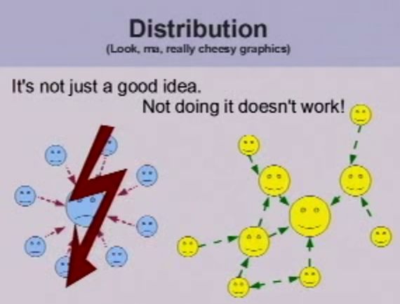
</br>
<small>Source: <a href="https://www.youtube.com/watch?v=4XpnKHJAok8#t=819">Linus 2007 Git Introduction</a></small>
Note: Using CVCS penalizes you from committing and branching since it is so expensive.  This causes developers to have very large commits.


##Centralized VCS
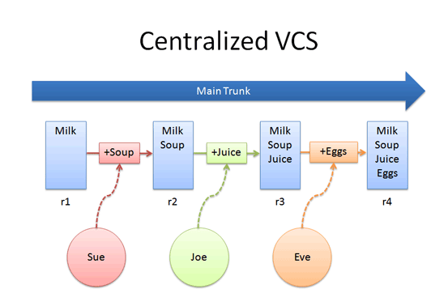
</br>
<small>Source: <a href="http://betterexplained.com/articles/intro-to-distributed-version-control-illustrated/">Illustrated Distributed Version Control</a></small>


##Distributed VCS
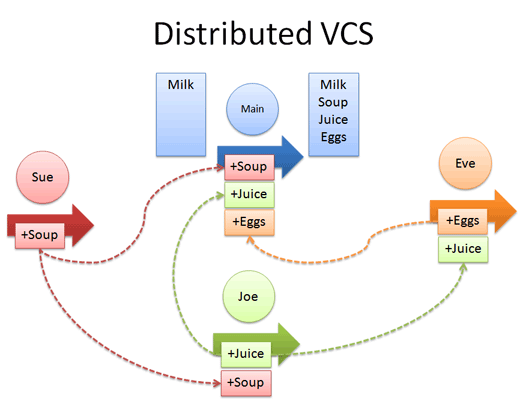
<small>Source: <a href="http://betterexplained.com/articles/intro-to-distributed-version-control-illustrated/">Illustrated Distributed Version Control</a></small>
Note: Every copy of a git branch becomes it's own branch when it falls off line or out of sync with origin. Git has a built in check for disk / file corruption since files are tracked using a hash.


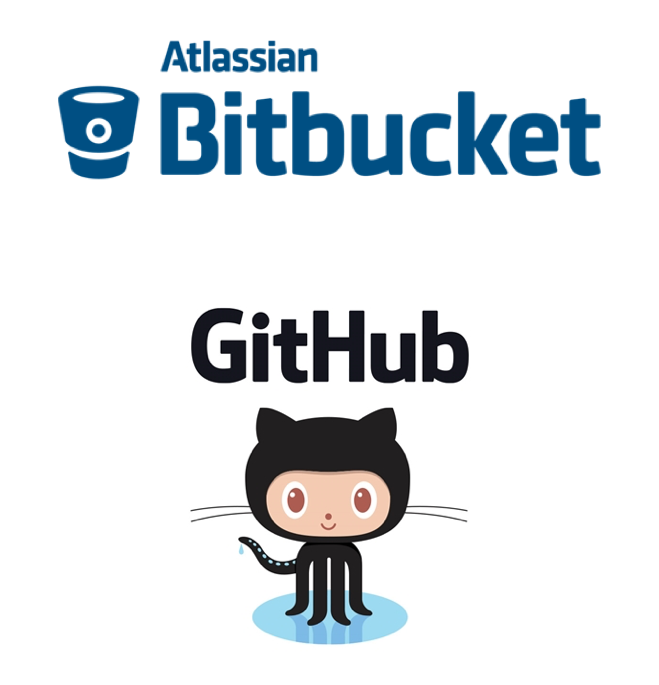


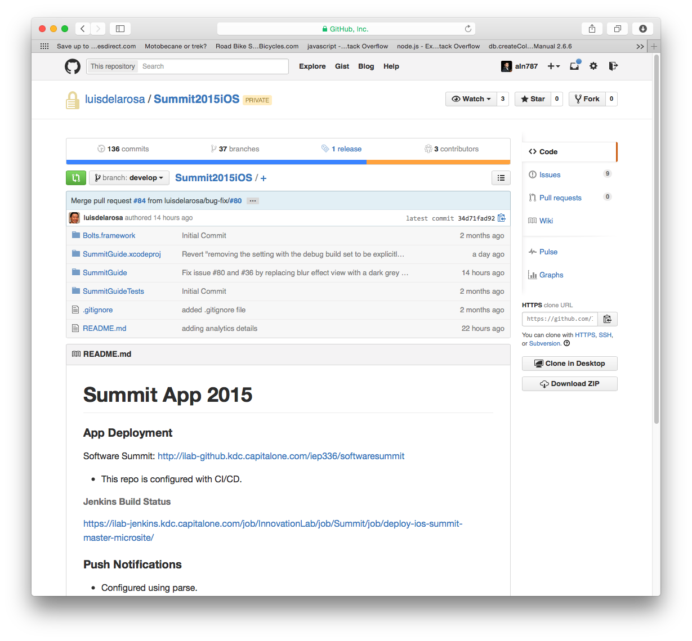


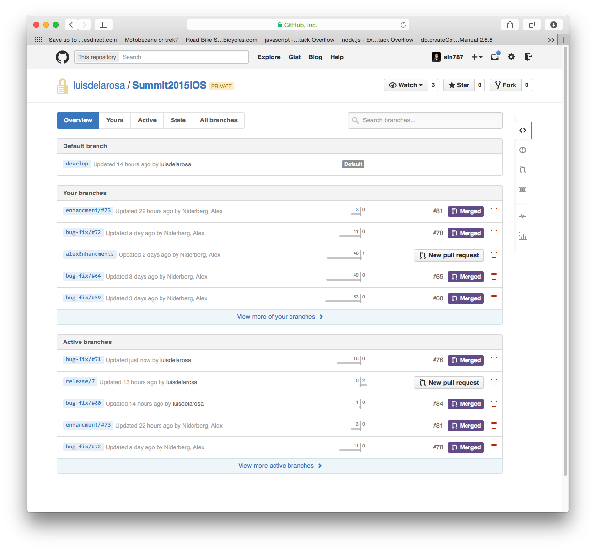


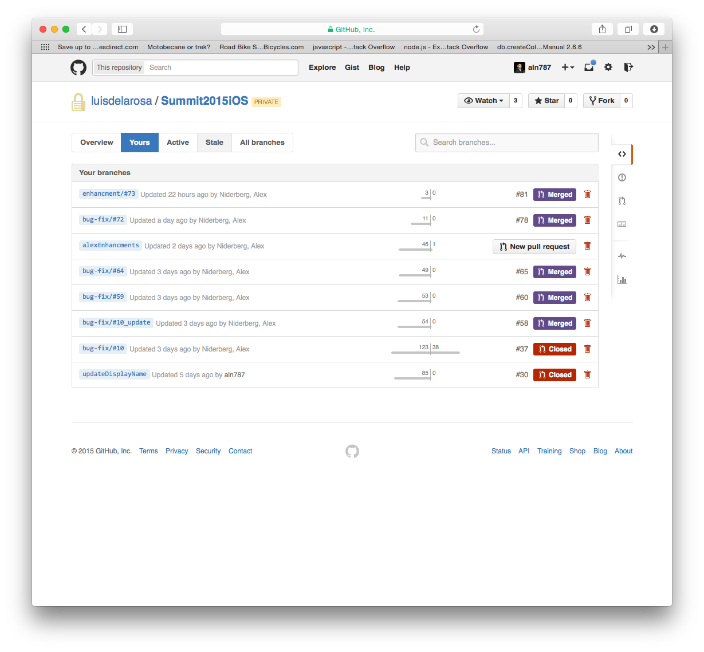


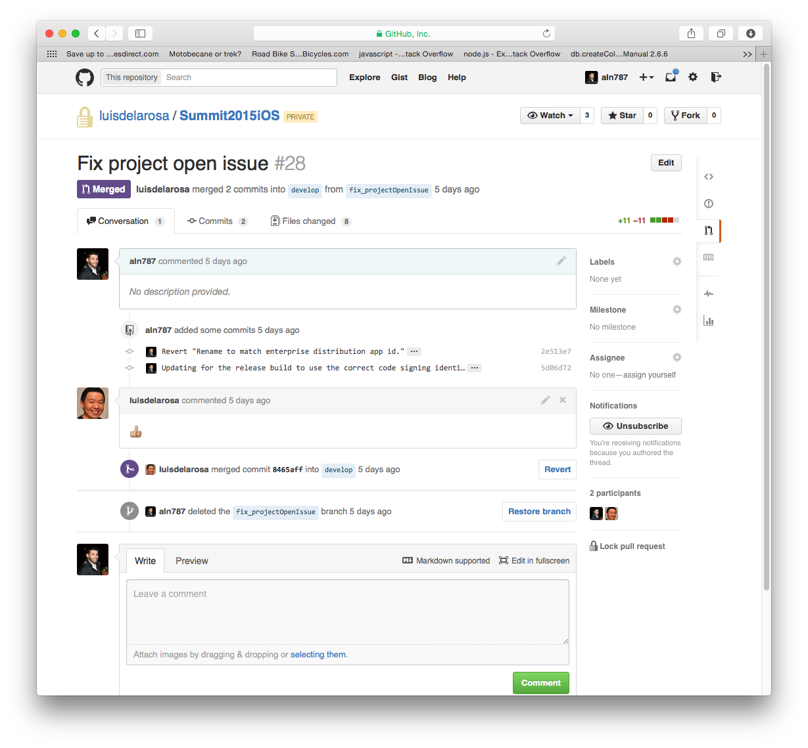


#[Animation Demo](https://bitbucket.org/aln787/flightinfo)
Note: This repo should have the demo, pull and confirm https://bitbucket.org/aln787/flightinfo

---

##Key Git Concepts
- Staging Area / Working Copy
- Commit Object
- .git repository
- Branches
- Stashing
- Merging
Note: Are git and github the same?


##Edit / Stage / Commit
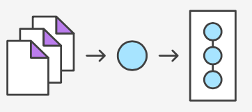
Note: What you are actually staging is a snapshot.  With every change you need to re-add it or stage it using git add.


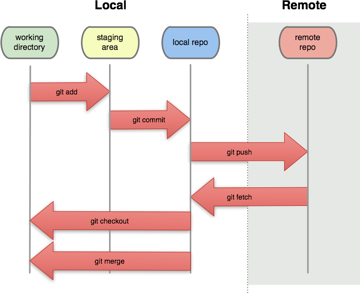


##What does commit object hold?
- reference to parent commit, if any
- tree - set of files conveying current state of the project
- author info, commiter info, commit message, etc.
Commit object is uniquely identified by a 40-character SHA1 hash


##Git Repository
Git stores information about your project in .git subdirectory referred to repository


##What does .git include?
- commit objects
- HEAD - a set of reference to commit objects
- ..more..


##Branching
A branch is collection of commit objects
When initializing a git repo the default branch is master
<pre><code>
    (1) -- (2) -- (3)
                   |
                 master
                   |
                  HEAD
</code></pre>
HEAD points to commit (3) on master branch


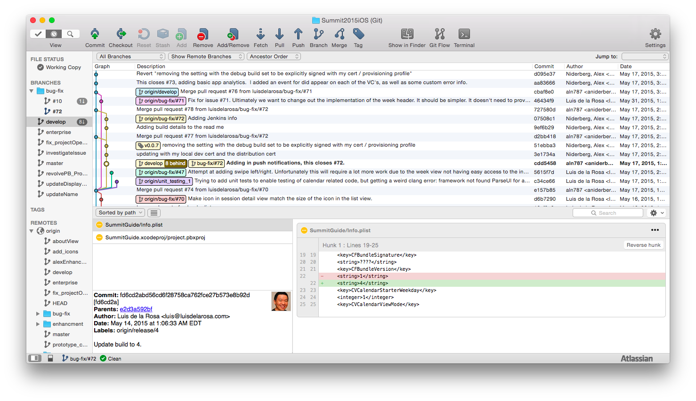


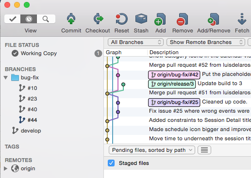


#Stashing
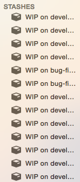


##Switching to a new branch
<pre><code>
    # creates a new branch
    $ git branch [new-branch-name] 
    # move HEAD to point to new branch
    $ git checkout [new-branch-name] 
</code></pre>
<pre><code>
    $ git checkout -b [new-branch-name]
</code></pre>


##Example workflow
- Create a new branch
- Make code changes
- Commit changes
- Run tests on code
- If test success merge those changes back to master branch


##Merging
<pre><code>$ git merge [branch-name]</code></pre>


##Before merging
<pre><code>
                        bug-fix 
                          |
             +----(4)----(5)
            /             
  (1) -- (2) -- (3)
                 |
               master
                 |
                HEAD

</code></pre>


##$ git merge bug-fix
<pre><code>
                        bug-fix 
                          |
             +----(4)----(5)+
            /                \
  (1) -- (2) -- (3)----------(6)
                              |
                            master
                              |
                             HEAD
</code></pre>
(6) contains changes between (5) and (2) merged into (3)

---

##Git in Action
- Status
- Init
- Clone
- Diff
- Commit


##Check for git repo
<pre><code>
$git status
fatal: Not a git repository (or any of the 
parent directories): .git
</code></pre>


##Initializing Repository
<pre><code>
$ mkdir [project-name]
$ cd [project-name]
$ git init
</code></pre>
<pre><code>
git-collab/
  .git/
    config
    description
    HEAD
    hooks/
    info/
    objects/
    refs/
</code></pre>


##Cloning existing repository
<pre><code>
$ git clone [git-url]
$ git clone https://github.com/vmaliwal/git-collab.git
</code></pre>


##Untracked Changes / Files
<pre><code>
$ git status
On branch master
Your branch is up-to-date with 'origin/master'.

Changes not staged for commit:
(use "git add <file>..." to update what will be committed)
(use "git checkout -- <file>..." to discard changes in working directory)

modified:   README.md
modified:   index.html

Untracked files:
(use "git add <file>..." to include in what will be committed)

images/CentralizedVCS.png
images/DistributedVCD.png
images/LinusViewDVCS.png

no changes added to commit (use "git add" and/or "git commit -a")
</code></pre>


##Git Diff
<pre><code>
$ git diff README.md 
diff --git a/README.md b/README.md
index f08ca69..10ea20b 100644
- a/README.md
+ b/README.md
@@ -1 +1,9 @@
-### Introduction to Git 
\ No newline at end of file
+### Introduction to Git 
+
+- run
+```
+npm install
+grunt serve
+```
+
+- Make changes by modifying index.html
\ No newline at end of file
</code></pre>


##Creating a commit object
Create a new file or modify existing
<pre><code>$ echo "Introduction to Git" > README</code></pre>

<pre><code>
$ git status
# On branch master
#
# Initial commit
#
# Untracked files:
#   (use "git add [file]..." 
# to include in what will be committed)
#
# README
</code></pre>

Note: When creating a new file or updating existing file and saving those changes will create a commit object


##Add
<pre>
	<code>
$ git add [file-name]
$ git commit -m "Initial commit"
	</code>
</pre>

<pre>
	<code>
$ git add . //to add all modified files, or
$ git commit -a -m "Initial commit"
	</code>
</pre>


##Commit
<pre>
	<code>
Git commit -a #is the same as using git add and then git commit
git config --global color.ui true
	</code>
</pre>

---

##Additional Git Concepts
- git config
- vim .gitignore
- git diff [ --staged | --cached ]
- git add --patch
- git [command] --help or man git


##Git Config
- git config --list
- git config --global user.name "Your Name"
- git config --global user.email yourEmail@gmail.com
- git config --global push.default simple #remove verbose messaging about the git 2.0 change
- git config --global core.editor "subl -n -w" #editor for commit messages
- git commit -a #will bring up sublimetext so you can enter you commit message


<h2><span style="text-transform: lowercase;">.gitignore</span> the unsung hero</h2>
- It is very important to have this file in your project root directory to avoid merge conflicts from auto-generated code from VM, IDE, etc.
- Google for gitignore nodejs/golang/java/android/iOS


##Diff Options
<pre><code>
#git diff [ --staged | --cached ]
$ git status
# At least 1 file is staged
$ git diff --staged
# Reveals the staged changes
$ git reset #to push those changes back to the working copy
</code></pre>


##Break Changes into Smaller Pieces
<pre><code>
#git add --patch [file]
$ git add --patch
#Use s for smaller y, n, ...
</code></pre>


##Get Git Help
<pre><code>
#git [command] --help or man git
$ git diff --help
$ man git
# Then use / to search for --ca
</code></pre>

---

##Collaboration
- Distributed version control model to collaborate between multiple developers.

  - Remote repository
  - Pull remote changes
  - Push local changes to remote


##Remote repository
- Remote repositories are versions of your project that are hosted on the Internet or network somewhere.
  
  - Create a new remote repository(on github, bitbucket, etc.) and clone to your local machine. Or,
  - Add existing git repo from your local machine to remote


##Create a new remote repo and clone to your local machine
- Create new remote repository on github or bitbucket
<pre><code>$ git clone [git-remote-repo-url].git</code></pre>
- As name suggests <span style="color: #1b91ff">clone</span> command can be used to clone any remote repository 


##Add existing git repo from local machine to remote
Create new repository on <a href="https://help.github.com/articles/creating-a-new-repository/" title="">github</a> or bitbucket
On your local machine..
<pre><code>
$ git remote add origin [git-remote-repo-url].git
$ git push -u origin master
</code></pre>
<p><span style="color: #1b91ff">origin</span> is a remote repository reference that git uses</p>


##Pulling remote changes
<pre><code>
$ git pull [remote-repo-reference] [remote-branch-name]
$ git pull origin master
</code></pre>


##Pushing changes to remote
<pre><code>
$ git push [remote-repo-reference] [remote-branch-name]
$ git push origin master
</code></pre>


##Multiple Remotes
<pre><code>
origin  https://github.com/aln787/git-collab.git (fetch)
origin  https://github.com/aln787/git-collab.git (push)
14109fd767af:git-collab xvo202$ git remote add kdc https://github.kdc.capitalone.com/xvo202/git-collab.git
14109fd767af:git-collab xvo202$ git remote -v
kdc https://github.kdc.capitalone.com/xvo202/git-collab.git (fetch)
kdc https://github.kdc.capitalone.com/xvo202/git-collab.git (push)
origin  https://github.com/aln787/git-collab.git (fetch)
origin  https://github.com/aln787/git-collab.git (push)
</code></pre>


#Fork and Pull
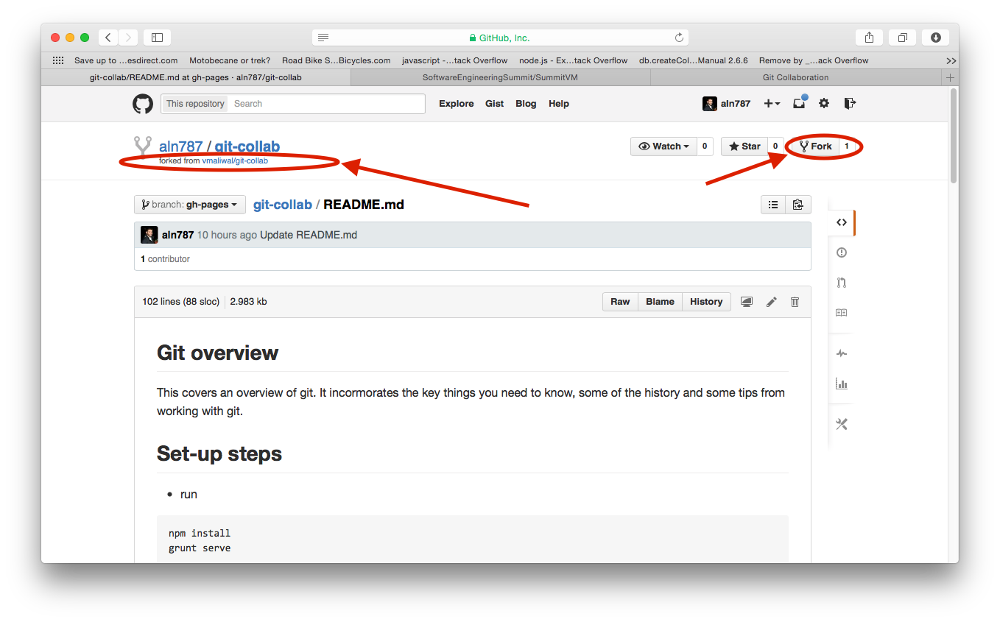


##[Fork Exercise](https://github.com/C1-SoftwareEngineeringSummit/GitExercise)

Note: https://github.com/aln787/git-collab/wiki#exercise


##Merge conflicts
While pulling or merging a branch merge conflicts can occur due to conflicting changes


<pre><code>
$ git checkout -b develop
</code></pre>


<pre><code>
$ git branch
* develop
  master 
</code></pre>


<pre><code>
$ git checkout master
</code></pre>


<pre><code>
$ git merge develop
Auto-merging app.js
CONFLICT (content): Merge conflict in app.js
Automatic merge failed; fix conflicts and then commit the result.
</code></pre>


###$ git merge-tool


---

#Tips and Tricks


####If you are ever unsure what to do when using Git, copy your project directory.


##Setting Up SSH Keys
<pre><code>
$ ls -al ~/.ssh
$ ssh-keygen -t rsa -b 4096 -C "youremail@email.com"
$ eval "$(ssh-agent -s)"
$ ssh-add ~/.ssh/id_summit2016
$ cat ~/.ssh/id_summit2016.pub 
</code></pre>
Then add the output of the cat to your list of github ssh keys on the github site.  
<pre><code>$ ssh -T git@github.com</code></pre>
</br>
<a href="https://help.github.com/articles/generating-ssh-keys">Full Set-up details</a>


##Additional Git Commands
- git diff HEAD^ --word-diff
  - git config --global help.autocorrect1
- git config --global color.ui 1
- git commit --amend -C HEAD
  - Use this to add changes you forgot to add to the last commit that are currently staged

---

###References
- http://git-scm.com/
- [SO git questions](http://stackoverflow.com/questions/tagged/git)
- https://help.github.com/
- [May 3rd, 2007 - Linus Torvalds Git Talk](https://www.youtube.com/watch?v=4XpnKHJAok8)
- [Great git talk from one of the git scm writers](https://www.youtube.com/watch?v=ZDR433b0HJY)
- [Git History](https://www.atlassian.com/git/articles/10-years-of-git/)
- [Original Presentation](https://github.com/vmaliwal/git-collab)
Note: http://git-scm.com/book/en/v2/Getting-Started-About-Version-Control